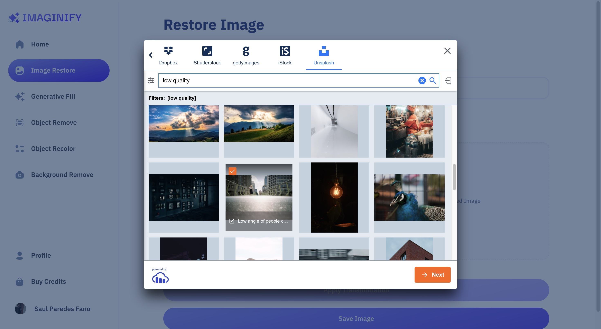
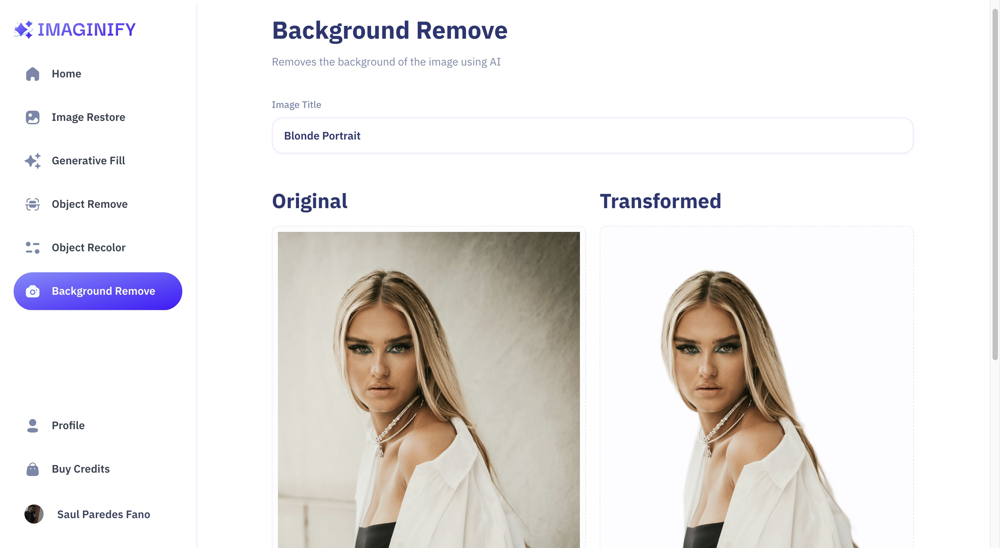
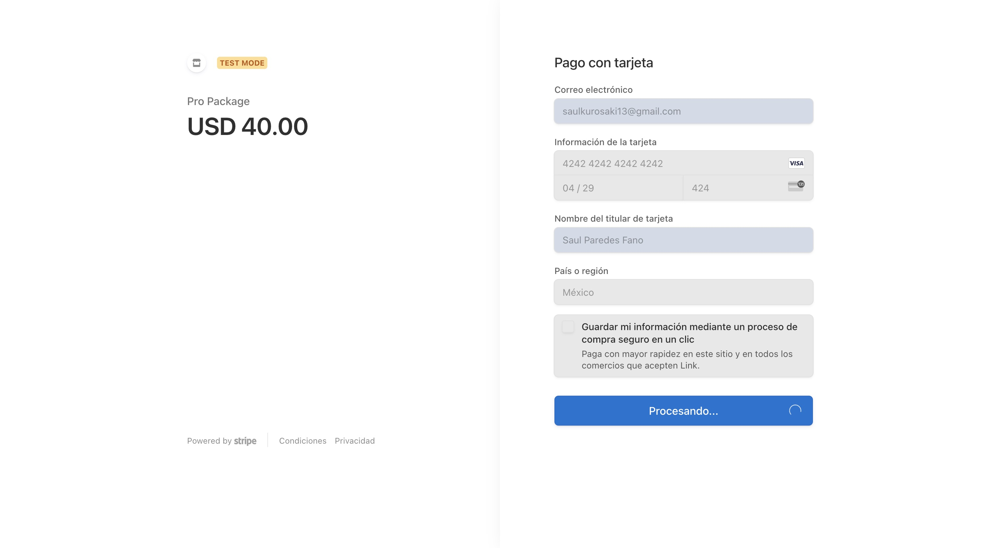
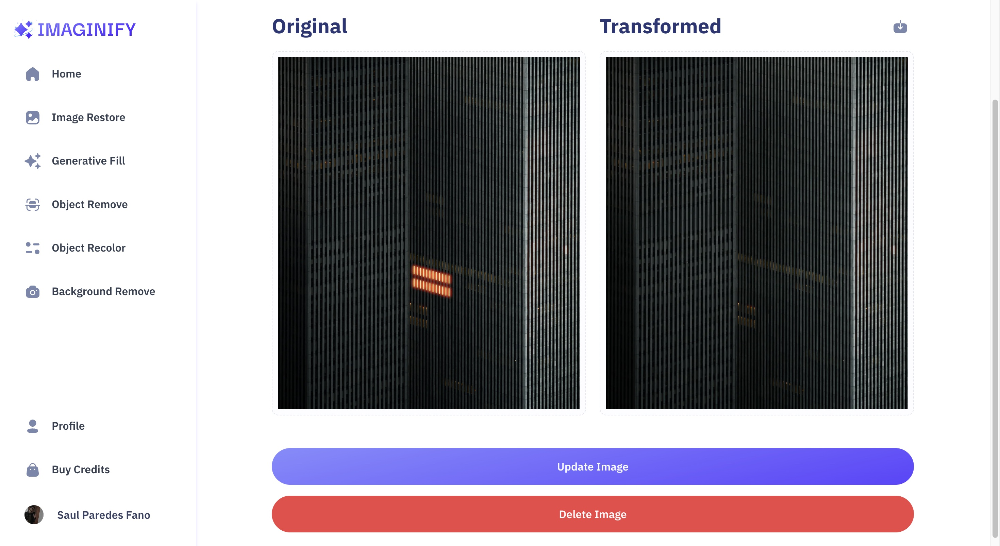
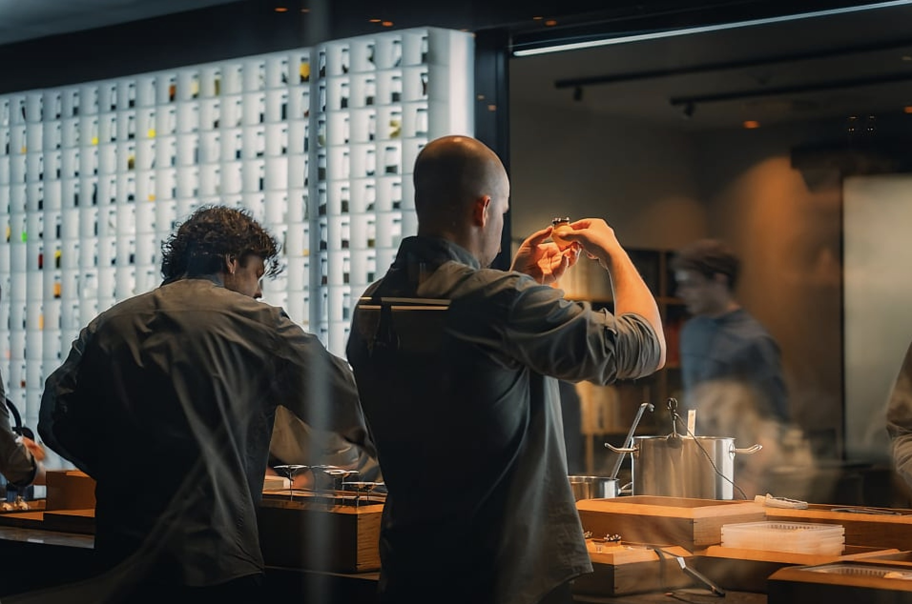

# IMAGINIFY PROJECT

## <a name="tech-stack">⚙️ Tech Stack</a>

- Next.js
- TypeScript
- MongoDB
- Clerk
- Cloudinary
- Stripe
- Shadcn
- TailwindCSS

## <a name="features">🔋 Features</a>

👉 **Authentication and Authorization**: Secure user access with registration, login, and route protection.

👉 **Community Image Showcase**: Explore user transformations with easy navigation using pagination

👉 **Advanced Image Search**: Find images by content or objects present inside the image quickly and accurately

👉 **Image Restoration**: Revive old or damaged images effortlessly

👉 **Image Recoloring**: Customize images by replacing objects with desired colors easily

👉 **Image Generative Fill**: Fill in missing areas of images seamlessly

👉 **Object Removal**: Clean up images by removing unwanted objects with precision

👉 **Background Removal**: Extract objects from backgrounds with ease

👉 **Download Transformed Images**: Save and share AI-transformed images conveniently

👉 **Transformed Image Details**: View details of transformations for each image

👉 **Transformation Management**: Control over deletion and updates of transformations

👉 **Credits System**: Earn or purchase credits for image transformations

👉 **Profile Page**: Access transformed images and credit information personally

👉 **Credits Purchase**: Securely buy credits via Stripe for uninterrupted use

👉 **Responsive UI/UX**: A seamless experience across devices with a user-friendly interface

and many more, including code architecture and reusability

##

