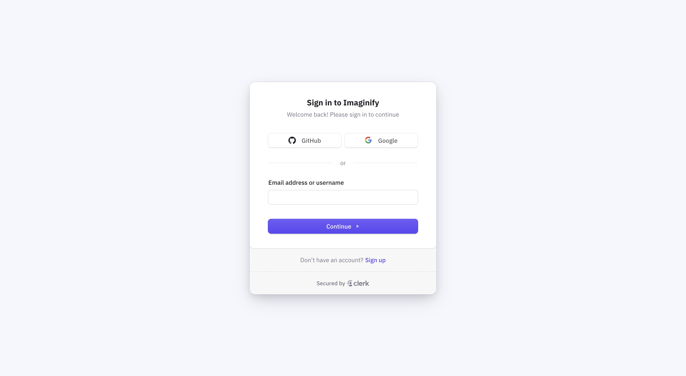
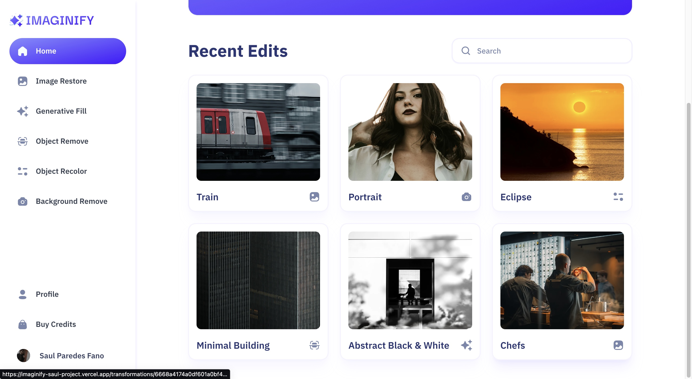
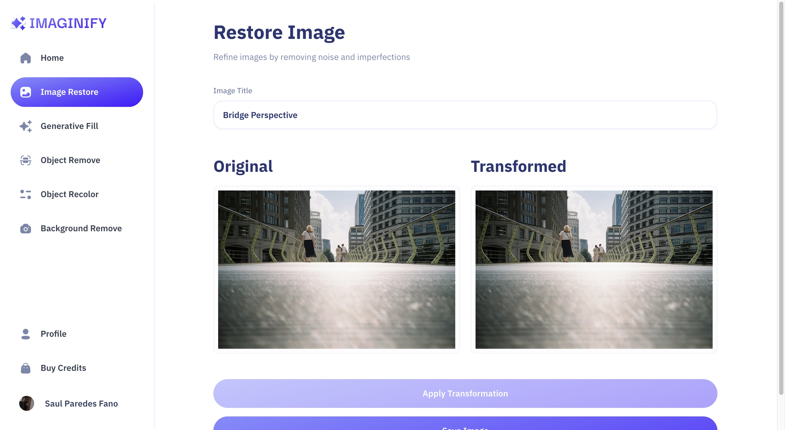
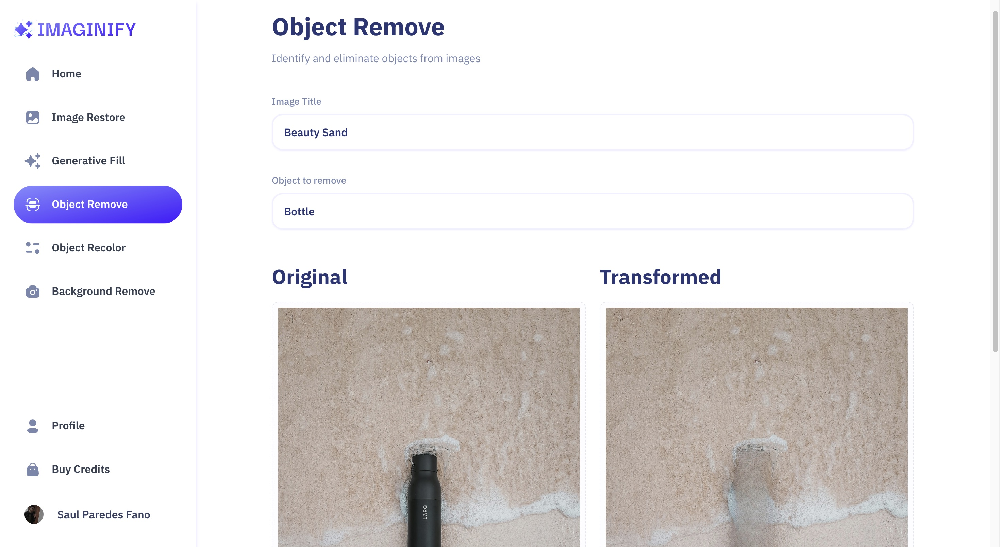
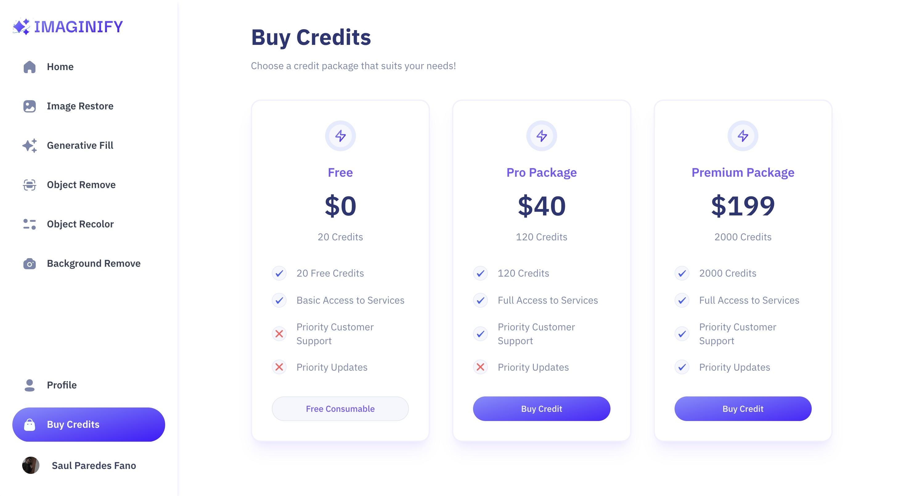
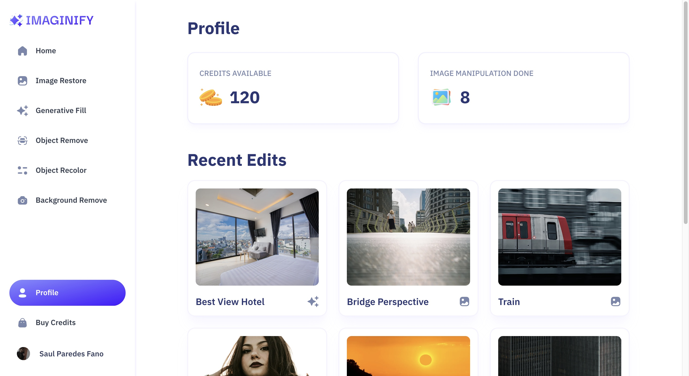

# 🚀 PODCASTR: Full-Stack AI-Powered Podcast Generation Platform

## **STRATEGIC ARCHITECTURE & BUSINESS VALUE**

### 🎯 Identified Market Problem & Value Proposition

> **Core Problem:** The high barrier to entry, complexity, and expense associated with professional podcast production, requiring multiple tools for audio and visual asset creation.
>
> **T-Shape Solution:** A cutting-edge **AI SaaS platform** enabling simplified content creation (text-to-audio conversion with multi-voice AI) and thumbnail generation. The solution reduces production cost and accelerates content creators' *time-to-market*.

### 📈 Key Metrics, Anti-AI Strategy, and Business Alignment

*   **Performance Priority:** Focused on **seamless playback and rapid content loading** (FCP/LCP), essential for user retention on content discovery platforms.
*   **Strategy Anti-AI:** The integration of **OpenAI and Convex** required architectural foresight to manage real-time data flow and **AI API costs**. This necessitates strategic judgment rooted in **Business Domain Understanding**.
*   **Monetization/Value Stream:** Designed as a monetizable platform (implied SaaS) by offering **advanced AI content creation features** and simplifying the path to content hosting.

---

## **DEEP SOFTWARE ARCHITECTURE**

### 🛠️ Core Technology Stack

| Technology | Role and Strategic Justification |
| :--- | :--- |
| **Framework** | Next.js 14 (TypeScript) |
| **Backend/DB** | Convex |
| **Styling** | Tailwind CSS / Shadcn UI |
| **Authentication** | Clerk |
| **AI/Services** | OpenAI |

### ⚙️ Key Architectural Decisions

1.  **Next.js (SSR/SSG):** Essential for maintaining high **SEO visibility** for podcast discovery and managing the complex server-side calls to the OpenAI API.
2.  **Convex:** Chosen as a Backend-as-a-Service to handle **real-time data needs** inherent in a multi-user content platform and accelerate deployment time.
3.  **OpenAI Integration:** Developed sophisticated server-side logic to handle the **Text-to-Audio and image generation** functionality, ensuring high-quality, diverse content output.
4.  **TypeScript:** Used throughout the application to guarantee the **scalability and robustness** required when integrating multiple external APIs and managing complex user data.

---

## **T-SHAPE SUPERPOWERS & EXECUTION CHALLENGES**

### 🧠 Strategic Challenges Overcome

*   **Challenge 1:** Managing the **latency and potential cost overruns** associated with continuous calls to the OpenAI API for content generation.
*   **Solution 1:** Implemented architectural constraints and efficient caching strategies to minimize unnecessary API calls.
*   **Challenge 2:** Ensuring **seamless playback** across various devices and network conditions.
*   **Solution 2:** Optimized asset delivery and utilized the native capabilities of Next.js for efficient data rendering.

### 💻 Local Setup (Quick Start)

```bash
# 1. Clone repo
git clone https://github.com/saulkurosaki/PODCASTR_PROJECT

# 2. Install dependencies
cd PODCASTR_PROJECT
npm install

# 3. Configure Environment Variables
# Create a .env.local file and add the necessary keys for Clerk, Convex, and OpenAI.

# 4. Start Development Server
npm run dev
```
---

















