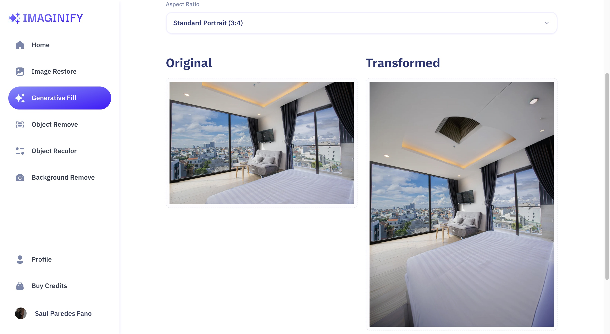
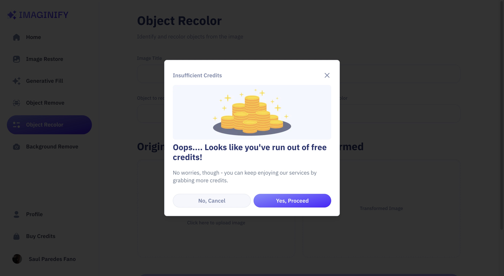
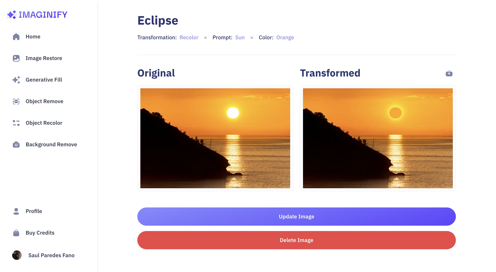

# 🚀 IMAGINIFY: AI-Powered Image SaaS Editor with Credit System

## **STRATEGIC ARCHITECTURE & BUSINESS VALUE**

### 🎯 Identified Market Problem & Value Proposition

> **Core Problem:** The high barrier to entry in professional creative tools and the lack of a scalable, monetized platform for high-quality AI image generation with controlled access.
>
> **T-Shape Solution:** Delivered a **REAL Software-as-a-Service (SaaS)** platform with advanced AI features, meticulously integrating a **payment and credits system (Stripe)** to ensure immediate monetization and user scalability for micro-entrepreneurs.

### 📈 Key Metrics, Anti-AI Strategy, and Business Alignment

*   **Performance Priority:** Critical focus on **Core Web Vitals** to ensure fast FCP/LCP despite handling heavy image assets (via Cloudinary), crucial for SEO and user retention.
*   **Strategy Anti-AI:** The architectural design implements **complex Stripe payment logic** and **credit system governance**—a strategic business decision the AI cannot autonomously architect. This proves **Business Domain Understanding**.
*   **Monetization/Value Stream:** Utilizes **Stripe** for subscription and credit purchasing flows, validating expertise in e-commerce and secure financial transaction architecture.

---

## **DEEP SOFTWARE ARCHITECTURE**

### 🛠️ Core Technology Stack

| Technology | Role and Strategic Justification |
| :--- | :--- |
| **Framework** | Next.js 14 (TypeScript) |
| **Backend/DB** | Cloudinary, Stripe, Convex (Database implied by SaaS model) |
| **Styling** | Tailwind CSS / Shadcn UI |
| **Authentication** | Clerk |
| **AI/Services** | AI features (OpenAI/similar), React Hook Form, Zod |

### ⚙️ Key Architectural Decisions

1.  **Next.js (SSR/SSG):** Chosen for its robustness in handling heavy server-side processing, essential for secure payment integration and managing AI generation requests.
2.  **TypeScript:** Essential for **scalability and maintainability** when linking multiple critical services (payments, storage, AI).
3.  **Stripe & Cloudinary Integration:** Complex integration between Clerk (Auth), Stripe (Payments), and Cloudinary (Asset Storage) to **govern the AI credit usage system**, proving strategic resource management.
4.  **Zod/React Hook Form:** Implemented for secure **form validation**, a vital component in any application handling financial transactions and user data.

---

## **T-SHAPE SUPERPOWERS & EXECUTION CHALLENGES**

### 🧠 Strategic Challenges Overcome

*   **Challenge 1:** Securely managing the **monetization logic (Stripe)** linked to **Cloudinary** storage and the actual AI usage (payment gateway integration).
*   **Solution 1:** Implemented secure webhooks and robust server-side validation to prevent credit abuse and ensure transaction integrity.
*   **Challenge 2:** Optimizing the application's performance to maintain high **Core Web Vitals** scores despite handling large image uploads and AI processing.
*   **Solution 2:** Use of **Cloudinary** for image processing and optimization, offloading heavy tasks from the main server.

### 💻 Local Setup (Quick Start)

```bash
# 1. Clone repo
git clone https://github.com/saulkurosaki/IMAGINIFY-PROJECT

# 2. Install dependencies
cd IMAGINIFY-PROJECT
npm install

# 3. Configure Environment Variables
# Create a .env.local file and add the necessary keys for Clerk, Stripe, Cloudinary, and AI services.

# 4. Start Development Server
npm run dev
```
---











